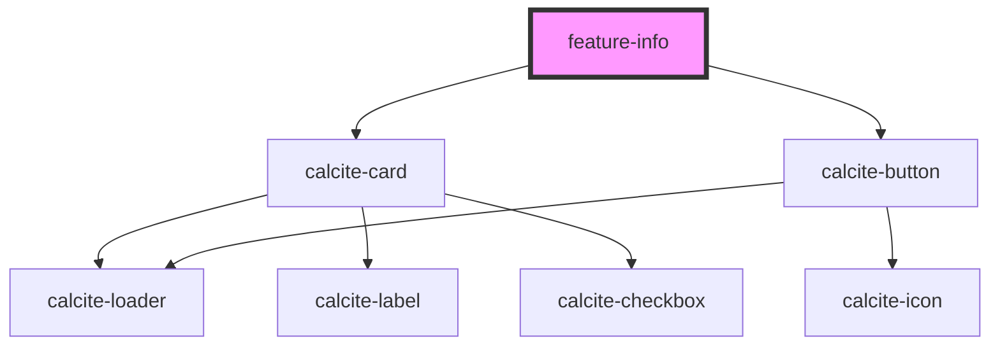

# feature-info

<!-- Auto Generated Below -->

## Properties

| Property          | Attribute   | Description | Type        | Default     |
| ----------------- | ----------- | ----------- | ----------- | ----------- |
| `feature`         | --          | Properties  | `Feature`   | `undefined` |
| `graphics`        | --          |             | `Graphic[]` | `undefined` |
| `selectedGraphic` | --          |             | `Graphic`   | `undefined` |
| `showZoom`        | `show-zoom` |             | `boolean`   | `undefined` |

## Events

| Event                   | Description   | Type                   |
| ----------------------- | ------------- | ---------------------- |
| `focusOnGraphic`        |               | `CustomEvent<Graphic>` |
| `selectedGraphicChange` | Public Events | `CustomEvent<Graphic>` |

## Dependencies

### Depends on

- calcite-card
- calcite-button

### Graph

----------------------------------------------

*Built with [StencilJS](https://stenciljs.com/)*
